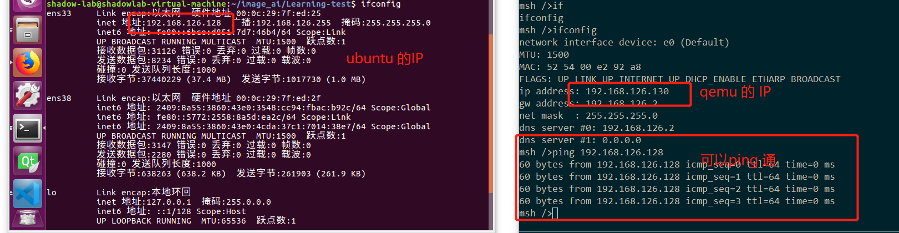

## 开篇闲谈

​      不知不觉，2019 年就这样随风而逝...远去了， 2020 年悄然接近...就在当下，如何不虚度光阴，如何好好掌握当下，这个难题一直都没找到答案，或许每个人心中都有属于自己的答案吧...


## 切入正题

  在前面的文章中，简单地介绍了如何在 Ububtu 中搭建图像识别的环境，主要是 Image-AI 的环境搭建，由于搭建环境是比较复杂的事情而且不确定的因素也很多，并不能保证不同的电脑不同的操作系统都会遇到同样的问题，前面的文章中只是简单地讲述了一下本人搭建环境中所遇到的一些问题和方法，具体的搭建还得依靠各位自行解决了。

### Image AI 环境的测试

  在这里就假设各位都搭建好了` image-ai `的环境，并且能通过和下面的测试。

（1）在用户目录下或者是桌面新建一个文件夹，命名为`image_ai_test` 文件夹。

（2）在 `image_ai_test` 文件夹中新建一个 `test.py `和 任意的一张图片命名为 `test.jpg`,还有把 `image-ai`所需要的模型文件拷贝到`image_ai_test`文件夹下，具体目录结构如下图所示：


(3) 在`test.py` 文件中添加如下的代码

```

from imageai.Prediction import ImagePrediction
import os
execution_path = os.getcwd()

prediction = ImagePrediction()
prediction.setModelTypeAsResNet()
prediction.setModelPath(os.path.join(execution_path, "resnet50_weights_tf_dim_ordering_tf_kernels.h5"))
prediction.loadModel()

predictions, probabilities = prediction.predictImage(os.path.join(execution_path, "test.jpg"), result_count=5 )
for eachPrediction, eachProbability in zip(predictions, probabilities):
    print(eachPrediction + " : " + eachProbability)

```

(4)在命令行中运行 `test.py`文件，输入`python3 test.py`即可，运行结果如下所示：


  到此 image-ai 的环境测试已经完成了，并且学会了如何使用一个已有的模型进行图片识别。

### 基于 RT-Thread 操作系统的 QEMU 的环境搭建和使用

​    这里将要简单说明一下如何搭建基于 RT-Thread 操作系统的 QEMU 的环境。

(1) 通过浏览器打开`RT-Thread `的官网`https://www.rt-thread.org`,在文档中心找到关于 QEMU 的环境搭建的文章，根据文档的步骤一步一步操作即可。


（2）根据上面的步骤按照官方文档的操作，搭建`qemu`的环境，设置 `tap`网卡与 `ubuntu` 虚拟机通信，本机使用的桥接模式把`ubuntu`虚拟机的网卡与`tap`网卡进行桥接，方法很简单选中这两张网卡后，右键选择桥接即可，如下图所示：


（3）测试 `ubuntu` 虚拟机与 `qemu`虚拟机的之间的网络是否能`ping` 通。




## 未完待续

   到这里已经把 Image AI 的环境 和 运行 RT-Thread 系统的 qemu 的环境搭建和测试好了，下一章节中将会进入使用 `flask`框架实现 `web`接收图片的功能和使用 RT-Thread 的 webclient 软件包，上传图片文件的功能.....